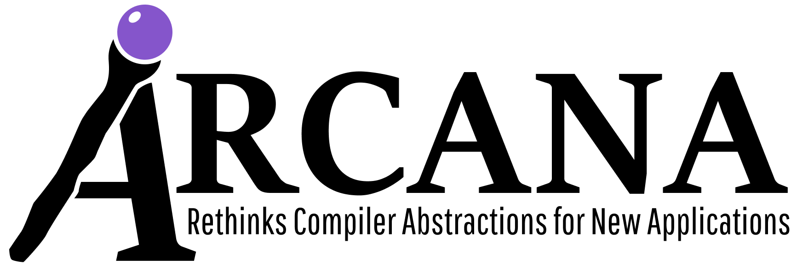

# Gino 

[](https://gist.github.com/cheerfulstoic/d107229326a01ff0f333a1d3476e068d)

<p></p>

- [Description](#description)
- [Version](#version)
- [Status](#status)
- [Prerequisites](#prerequisites)
- [Building Gino](#building-gino)
- [Testing Gino](#testing-gino)
- [Repository structure](#repository-structure)
- [Projects built upon Gino](#Projects-built-upon-Gino)
- [Contributions](#contributions)
- [License](#license)
- [Logo](#logo)


## Description
Gino is a parallelizing compiler for LLVM IR.
Gino is built upon [NOELLE](https://github.com/arcana-lab/noelle), [VIRGIL](https://github.com/arcana-lab/virgil), and [LLVM](http://llvm.org).

We release Gino's source code in the hope of benefiting others. 
You are kindly asked to acknowledge usage of the tool by citing the following paper:
```
@inproceedings{NOELLE,
    title={{NOELLE} {O}ffers {E}mpowering {LL}VM {E}xtensions},
    author={Angelo Matni and Enrico Armenio Deiana and Yian Su and Lukas Gross and Souradip Ghosh and Sotiris Apostolakis and Ziyang Xu and Zujun Tan and Ishita Chaturvedi and David I. August and Simone Campanoni},
    booktitle={International Symposium on Code Generation and Optimization, 2022. CGO 2022.},
    year={2022}
}
```

The only documentation available for Gino is:
- a [video](https://www.youtube.com/watch?v=whORNUUWIjI&t=7s) introducing NOELLE and Gino
- the [paper](http://www.cs.northwestern.edu/~simonec/files/Research/papers/HELIX_CGO_2022.pdf)
- the comments within the code
- the slides we use in the class [Advanced Topics in Compilers](http://www.cs.northwestern.edu/~simonec/ATC.html)


## Version
The latest stable version is 9.3.0 (tag = `v9.3.0`).


### Version Numbering Scheme
The version number is in the form of \[v _Major.Minor.Revision_ \]
- **Major**: Each major version matches a specific LLVM version (e.g., version 9 matches LLVM 9, version 11 matches LLVM 11)
- **Minor**: Starts from 0, each minor version represents either one or more API replacements/removals that might impact the users OR a forced update every six months (the minimum minor update frequency)
- **Revision**: Starts from 0; each revision version may include bug fixes or incremental improvements


#### Update Frequency
- **Major**: Matches the LLVM releases on a best-effort basis
- **Minor**: At least once per six months, at most once per month (1/month ~ 2/year)
- **Revision**: At least once per month, at most twice per week (2/week ~ 1/month)

## Status
Next is the status of Gino for different LLVM versions.

| LLVM    | Gino's branch   | NOELLE's branch | Regression tests failed out of 30723 tests | Performance tests failed out of 23 tests    | Maintained         |
| ------: | --------------: | --------------: | -----------------------------------------: | ------------------------------------------: | :----------------: |
|  14.0.6 | v14             | v14             |                                        379 |                                           0 | :white_check_mark: |
|   9.0.0 | master          | master          |                                        379 |                                           0 | :white_check_mark: |


## Prerequisites
- LLVM 9.0.0
- NOELLE 9.17.0

### Northwestern
Next is the information for those that have access to the Zythos cluster at Northwestern.

To enable the correct LLVM, run the following command from any node of the Zythos cluster:
```
source /project/extra/llvm/9.0.0/enable
```

To enable the correct NOELLE, run the following command from any node of the Zythos cluster:
```
source /project/extra/noelle/9.17.0/enable
```

The guide about the Zythos cluster can be downloaded [here](http://www.cs.northwestern.edu/~simonec/files/Research/manuals/Zythos_guide.pdf).


## Building Gino
To build and install Gino: run `make` from the repository root directory.

Run `make clean` from the root directory to clean the repository.

Run `make uninstall` from the root directory to uninstall the Gino installation.


## Testing Gino
To run all tests in parallel using Condor, invoke the following commands:
```
make clean ; 
cd tests ;
make condor ;
```
To monitor how tests are doing: `cd tests ; make condor_watch`

To find out if all tests passed: `cd tests ; make condor_check`

To test Gino using condor to run all tests in parallel, go to "tests" and run "make condor".
This creates one `regression_X` sub-directory per configuration where `X` is going to be a number (e.g., `regression_42`).
Each single test within a given `regression_X` sub-directory will contain a `run_me.sh` script, which is automatically generated by `make condor`. 
To re-produce the compilation for a specific test for a specific configuration (e.g., the one associated with the current `regression_X` sub-directory), then do the following:
```
cd tests/regression_42 ;
cd THE_TEST_YOU_ARE_INTERESTED ;
./run_me.sh ;
```
where `regression_42` is the sub-directory of the configuration you are interested and `THE_TEST_YOU_ARE_INTERESTED` is the test you care.

To run only the autotuned performance tests using Condor, invoke the following commands:
```
make clean ;
cd tests ;
make condor_autotuner ;
```
The speedup results will be collected in the tests/performance/speedups_autotuner.txt file.

## Repository structure
The directory `src` includes sources of the Gino parallelizer.
Within this directory, `src/core` includes the analyses and transformations needed by Gino to parallelize the code.
Also, `src/tools` includes tools that can be used to diagnose Gino (e.g., to understand the decisions Gino made to parallelize the code).

The directory `tests` includes integration tests, and performance tests.
Furthermore, this directory includes the scripts to run all these tests in parallel via condor.

Finally, the directory `doc` includes the documentation of Gino.


### Contributing to Gino
Gino uses `clang-format` to ensure uniform styling across the project's source code.
`clang-format` is run automatically as a pre-commit git hook, meaning that when you commit a file `clang-format` is automatically run on the file in-place.

Since git doesn't allow for git hooks to be installed when you clone the repository we manage this with our top-level Makefile.
To install the Gino git hooks, run `make hooks` at the root of the directory.
This make rule is run at the start of the `make all` rule as well for ease of use.


## Projects built upon Gino
Several projects have already been built successfully upon Gino.
These projects are (in no particular order):
- [HBC](https://github.com/arcana-lab/heartbeatcompiler)
- [SPLENDID](https://dl.acm.org/doi/10.1145/3582016.3582058)
- [CCK](https://github.com/arcana-lab/cck)


## Contributions
We welcome contributions from the community to improve this framework and evolve it to cater for more users.
If you have any trouble using this framework feel free to reach out to us for help (contact simone.campanoni@northwestern.edu).


## License
Gino is licensed under the [MIT License](./LICENSE.md).


## Logo


Gino is the name of our cat we have taken home from the [Tree house cat shelter](https://treehouseanimals.org) when we moved to Chicago.

It was surprisingly hard to find a picture of Gino by himself. 
He is always playing and cuddling with his brother Gigi like here:


A future project may or may not be called Gigi.


